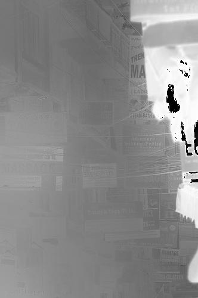

# dehazing-dark-channel
Dehazing with the Dark Channel Prior based on a paper by [He et al.](http://kaiminghe.com/cvpr09/).
Implementation in Python 3.8. Dependencies: NumPy 1.20.2 and Pillow 8.2.0.

    
 

